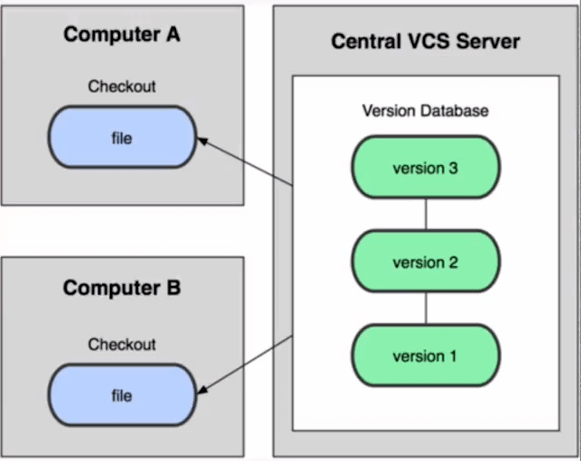

# Curso Profesional de Git y GitHub<!-- omit in toc -->

## Tabla de Contenido<!-- omit in toc -->
- [Sistema de control de versiones](#sistema-de-control-de-versiones)
  - [Tipos de sistemas de control](#tipos-de-sistemas-de-control)
- [Beneficios de Git](#beneficios-de-git)
- [Fundamentos de Git](#fundamentos-de-git)
- [Los 3 estados de Git](#los-3-estados-de-git)
- [Github](#github)
- [Configurar Git](#configurar-git)
- [Comandos de terminal](#comandos-de-terminal)
- [Comandos Git](#comandos-git)
  - [Flujos de Trabajo](#flujos-de-trabajo)
  - [Múltiples entornos de trabajo](#múltiples-entornos-de-trabajo)
- [Repositorios Remotos (Github)](#repositorios-remotos-github)
- [Comandos colaborativos](#comandos-colaborativos)
- [Configuraciones de Github](#configuraciones-de-github)
  - [Notificaciones](#notificaciones)
  - [Proteger un branch](#proteger-un-branch)
  - [Plantillas](#plantillas)
  - [Ignorar archivos](#ignorar-archivos)
  - [Issues y Milestones](#issues-y-milestones)
  - [Hosting Gratuito de archivos en GitHub](#hosting-gratuito-de-archivos-en-github)
  - [Dominios personalizados en GitHub](#dominios-personalizados-en-github)
  - [GitHub Desktop, todo lo que necesitas de Git en una sola herramienta gráfica](#github-desktop-todo-lo-que-necesitas-de-git-en-una-sola-herramienta-gráfica)
- [Recursos Complementarios](#recursos-complementarios)
- [Enlaces de Interés](#enlaces-de-interés)

## Sistema de control de versiones

Un sistema que registra los cambios realizados sobre un archivo o conjunto de archivos a lo largo del tiempo. Este tipo de sistemas nos permiten volver en el tiempo y salvar nuestro trabajo.


* https://learngitbranching.js.org/?locale=es_AR


<div align="right">
  <small><a href="#tabla-de-contenido">🡡 volver al inicio</a></small>
</div>

### Tipos de sistemas de control

`Local Computer` Solo vive en nuestro computador.

<div align="center">
  
  <small><p>Sistema de Control Local</p></small>
</div>

`Centralizado` No depende únicamente de un computador en el que se trabaja, sino que depende del súper servidor en donde se almacena la información. El servidor provee las copias a sus hijos, pero solo guarda los cambios en un solo lugar.

<div align="center">
  
  <small><p>Sistema de Control Centralizado</p></small>
</div>

`Sistema de control distribuidos` Cada uno de los que participan en el proyecto, tienen copia del proyecto que se realiza, por eso no dependemos de un solo computador que almacene toda la información.

<div align="center">
  
  <small><p>Sistema de Control Distribuido</p></small>
</div>

Git es un Sistema de Control de Versiones Distribuido.

Git fue creado por Linus Torvals

<div align="right">
  <small><a href="#tabla-de-contenido">🡡 volver al inicio</a></small>
</div>

## Beneficios de Git

* `Velocidad` Puedes trabajar fluidamente desde tu computador.
* `Diseño sencillo` El codigo es robusto con las herramientas necesarias, como viajar en el tiempo.
* `Fuerte apoyo en el desarrollo no lineal` No trabaja de manera lineal, la linea del tiempo tiene bifurcaciones de manera independiente al proyecto principal.
* `Completamente distribuido` Cada quien puede tener una copia del proyecto.
* `Capaz de manejar grandes proyectos` Linux, Django, Laravel, etc. Usan git.

<div align="right">
  <small><a href="#tabla-de-contenido">🡡 volver al inicio</a></small>
</div>

## Fundamentos de Git

* Git almacena una referencia a todos los archivos que no se han cambiado
* Casi cualquier operación en Git es local. Se puede trabajar offline
* Git tiene integridad. No puedes perder información durante su transmisión o sufrir corrupción de archivos sin que Git lo detecte

<div align="center">
  
  <small><p>Almacenamiento de Archivos en GIT</p></small>
</div>

<div align="center">
  
  <small><p>Almacenamiento de Archivos en Subversion</p></small>
</div>

<div align="right">
  <small><a href="#tabla-de-contenido">🡡 volver al inicio</a></small>
</div>

## Los 3 estados de Git

* `Working Directory` Es donde trabajamos de manera local, pero para guardarlo hay que pasarlo al Staging Area
* `Staging Area` Es el área de preparación, se almacenan justo antes de hacer commit
* `Git repository` El repositorio donde almacenaremos los cambios del proyecto

<div align="center">
  
  <small><p>Estados de Git</p></small>
</div>

<div align="right">
  <small><a href="#tabla-de-contenido">🡡 volver al inicio</a></small>
</div>

## Github

`GitHub` es una plataforma en la que se almacenan los cambios de un proyecto. Además es una plataforma que funciona como una red social. Aquí, las personas que visiten tu sitio puedan darle estrellitas a los proyectos que hayas desarrollado.

`Git` es el software que ayuda con el versionado y Github es la red social que nos va a ayudar a distribuir el software.

<div align="right">
  <small><a href="#tabla-de-contenido">🡡 volver al inicio</a></small>
</div>

## Configurar Git

Configuración del usuario

```bash
git config --global user.email user@example.com
git config --global user.name "Sergio Minei"
```

Colorear el output del terminal de Git.

```bash
git config --global color.ui true
```

Configurar el editor de texto de git

```bash
git config --global core.editor ["editor --wait"]
```

Ver la lista de configuraciones

```bash
git config --list
```

<div align="right">
  <small><a href="#tabla-de-contenido">🡡 volver al inicio</a></small>
</div>

## Comandos de terminal

* `cd [carpeta]` moverse entre carpeta.
* `mkdir [nombre]` crear una carpeta.
* `ls` lista todos los directorios.
  * `-a` muestra los archivos ocultos.
* `clear` limpia la vetnana.
* `touch [archivo]` crear un archivo.
* `rm [ruta]` borra un archivo.
* `rm -rf [carpeta]` borra una carpeta.
* `vim [nombre]` editar un archivo de texto.
* `:wq` guaradar y salirdel archivo de texto.

<div align="right">
  <small><a href="#tabla-de-contenido">🡡 volver al inicio</a></small>
</div>

## Comandos Git

### Flujos de Trabajo

* `git init [nombre]` inicia un repositorio y crea la carpeta [nombre].
* `git status` muestra el estado de los archivos en el repositorio.
  * `untracked files` son archivos que están en nuestro Working Directory, lo que aparezca en rojo es lo que se ha modificado y hay que pasarlo al Staging.
  * `changes to be comitted` son los archivos que se encuentran en el staging area. Aparecen en verde.
* `git add [archivo]` agrega un archivo al staging
* `git add -A` agrega todos los archivos del working directory al staging area. `git add .` hace lo mismo.
 * `git add -n [archivo]` simula el agregado de un [archivo].
* `git rm --cached [archivo]` quita un [archivo] del staging al working area.
* `git rm -f` quita el archivo del staging y del working directory. La diferencia entre esto y simplemente borrar el archivo directamente es que se guarda en git un registro de eliminación.
* `git commit -m ["mensaje"]` agrega los archivos del staging al repositorio.
* `git commit --amend` anexa el nuevo cambio al anterior commit. Si se escribe un mensaje este sobreescribe el anterior.
* `git tag -a [tag] -m ["comentario"]` agrega el tag con un comentario al ultimo commit.
* `git tag -l` lista los tags.
* `git tag [tag] [sha1 del commit]` agrega un tag a un commit en partcular.
* `git tag -d [tag]` elimina el tag.
* `git tag -f -a [nuevo tag] [sha1 del commit]` renombra el tag del commit pero deja el anterior tag.
* `git log` ver la lista de commits.
  * `--stat` explica el número de líneas que se cambiaron brevemente.
  * `--stat` explica el número de líneas que se cambiaron y te muestra que se cambió en el contenido.
  * `--oneline` resumido.
  * `--graph` ver las ramificaciones.
  * `-[numero]` ver los ultimos [numero] commits.
  * `--author="Name Author"` nuestra los los logs de un autor
* `git relog` muestra el log completo de git, incluido branches eliminados.
* `git show` muestra los últimos cambios que se han hecho.
* `git diff [sha1 del commit]` muestra la diferencias del commit [sha1].
* `git diff [sha1-1] [sha1-2]` diferencia entre la version 1 vs la version 2.
* `git reset`
  * `--soft [sha1]` borrar todos los commits posteriores a [sha1]. Los archivos que salen del repositorio son pasados al staging area. Este comando resetea el HEAD al [sha1] mas no modifica ningún archivo.
  * `--mixed [sha1]` borrar todos los commits posteriores a [sha1]. Los archivos que salen del repositorio son pasados al working directory
  * `--hard [sha1]` elimina todos los cambios incluso del working directory.
  * `HEAD` saca los archivos del staging area. Este comando no elimina ningún archivo ni borra commits del git.
* `gitk` te muestra una ventana con toda la historia del repositorio.

Si se desea eliminar el repositorio, solo hay que eliminar la carpeta oculta .git

<div align="right">
  <small><a href="#tabla-de-contenido">🡡 volver al inicio</a></small>
</div>

### Múltiples entornos de trabajo

* `git branch [nombre]` crear la rama [nombre]
* `git branch -l` lista las ramas
* `git branch -r` muestra todas las ramas remotas
* `git branch -a` muestra todas las ramas tanto locales como remotas
* `git branch -d [nombre]` elimina el branch [nombre]. Esto solo funciona si el branch no tiene ningún commit.
* `git branch -D [nombre]` fuerza la eliminación de un branch sin importar si tiene commits
* `git branch -m [nombre inicial] [nuevo nombre] ` renombra el branch [nombre inicial] por [nuevo nombre]
* `git checkout [brach]` moverse al branch [branch]
* `git chechout [sha1]` ir al momento del tiempo de ese commit
* `git chechout [sha1] [archivo]` ir al momento del tiempo de ese commit de un archivo específico.
* `git checkout -b [nombre]` crea un branch y se mueva al mismo
* `git checkout -- [archivo]` descarta todos los cambios del archivo
* `git merge [branch]` mezcla el branch [branch] con el branch actual
* `git rebase [branch]` mezcla el [branch] con el branch actual. Es como el merge pero sin crear bifurcaciones. Para que funcione bien, primero se hace rebase a la rama con los cambios que queremos modificar y luego rebase a la rama final.
* `git stash` es un limbo como el staging area. Te permite cambiar de branch sin hacer commit.
* `git stash list` ver la lista de los stash.
* `git stash pop` aplica el ultimo stash a la rama actual.
* `git stash branch [brach]` mueve el stash al [branch]
* `git stash drop stash@{numero}` elimina el stash.
* `git stash apply stash@{numero}` aplica el stash.
* `git clean` elimina los archivos que no están bajo el control de versión. Para que funcione es necesario usar alguno de los flags:
  * `-n` no remueve nada, solo te muestra los archivos que va a eliminar.
  * `-f` elimina los archivos que no se encuentran versionados.
* `git cherry pick [sha1]` mover el commit [sha1] de otro branch al branch actual.

<div align="right">
  <small><a href="#tabla-de-contenido">🡡 volver al inicio</a></small>
</div>

## Repositorios Remotos (Github)

* `git clone [ruta]` trae el repositorio a la computadora
* `fork` hace una copia de un repositorio externo a nuestra cuenta
* `ssh-keygen -t rsa -b 4096 -C "correo@ejemploc.com"` crea una llave ssh. El correo debe de ser el mismo que se encuentra en Github
* `git remote add [nombre] [ruta]` conecta un repositorio remoto con uno local. Por defecto el nombre es origin
* `git remote -v` lista las conexiones remota
* `git remote remove [nombre]` remueve una conexión remota
* `git fetch [nombre] [branch]` traer . Solo los trae pero no lo mezcla
* `git merge [origin/master] --allow-unrelated-histories` hace un merge del fetch con el repositorio local
* `git pull [origin] [branch]` hace un fetch mas merge
* `git push [origin] [master]` envia al repositorio local al remoto
  * `--tags` enviar los tags
* `git push --all origin` push a todos los branch y tags

<div align="right">
  <small><a href="#tabla-de-contenido">🡡 volver al inicio</a></small>
</div>

# Git reset vs. Git rm
Git reset y git rm son comandos con utilidades muy diferentes, pero aún así se confunden muy fácilmente.

## git rm
Este comando nos ayuda a eliminar archivos de Git sin eliminar su historial del sistema de versiones. Esto quiere decir que si necesitamos recuperar el archivo solo debemos “viajar en el tiempo” y recuperar el último commit antes de borrar el archivo en cuestión.

Recuerda que git rm no puede usarse así nomás. Debemos usar uno de los flags para indicarle a Git cómo eliminar los archivos que ya no necesitamos en la última versión del proyecto:


* git rm --cached: Elimina los archivos de nuestro repositorio local y del área de staging, pero los mantiene en nuestro disco duro. Básicamente le dice a Git que   deje de trackear el historial de cambios de estos archivos, por lo que pasaran a un estado untracked.
* git rm --force: Elimina los archivos de Git y del disco duro. Git siempre guarda todo, por lo que podemos acceder al registro de la existencia de los archivos,   de modo que podremos recuperarlos si es necesario (pero debemos usar comandos más avanzados).

## git reset
Este comando nos ayuda a volver en el tiempo. Pero no como git checkout que nos deja ir, mirar, pasear y volver. Con git reset volvemos al pasado sin la posibilidad de volver al futuro. Borramos la historia y la debemos sobreescribir. No hay vuelta atrás.

Este comando es muy peligroso y debemos usarlo solo en caso de emergencia. Recuerda que debemos usar alguna de estas dos opciones:

Hay dos formas de usar git reset: con el argumento --hard, borrando toda la información que tengamos en el área de staging (y perdiendo todo para siempre). O, un poco más seguro, con el argumento --soft, que mantiene allí los archivos del área de staging para que podamos aplicar nuestros últimos cambios pero desde un commit anterior.


    git reset --soft: Borramos todo el historial y los registros de Git pero guardamos los cambios que tengamos en Staging, así podemos aplicar las últimas actualizaciones a un nuevo commit.
    git reset --hard: Borra todo. Todo todito, absolutamente todo. Toda la información de los commits y del área de staging se borra del historial.

## ¡Pero todavía falta algo!

* git reset HEAD: Este es el comando para sacar archivos del área de staging. No para borrarlos ni nada de eso, solo para que los últimos cambios de estos archivos no se envíen al último commit, a menos que cambiemos de opinión y los incluyamos de nuevo en staging con git add, por supuesto.

¿Por qué esto es importante?

Imagina el siguiente caso:

Hacemos cambios en los archivos de un proyecto para una nueva actualización. Todos los archivos con cambios se mueven al área de staging con el comando git add. Pero te das cuenta de que uno de esos archivos no está listo todavía. Actualizaste el archivo, pero ese cambio no debe ir en el próximo commit por ahora.

¿Qué podemos hacer?

Bueno, todos los cambios están en el área de Staging, incluido el archivo con los cambios que no están listos. Esto significa que debemos sacar ese archivo de Staging para poder hacer commit de todos los demás.

¡Al usar git rm lo que haremos será eliminar este archivo completamente de git! Todavía tendremos el historial de cambios de este archivo, con la eliminación del archivo como su última actualización. Recuerda que en este caso no buscábamos eliminar un archivo, solo dejarlo como estaba y actualizarlo después, no en este commit.

En cambio, si usamos git reset HEAD, lo único que haremos será mover estos cambios de Staging a Unstaged. Seguiremos teniendo los últimos cambios del archivo, el repositorio mantendrá el archivo (no con sus últimos cambios pero sí con los últimos en los que hicimos commit) y no habremos perdido nada.

Conclusión: Lo mejor que puedes hacer para salvar tu puesto y evitar un incendio en tu trabajo es conocer muy bien la diferencia y los riesgos de todos los comandos de Git.


## Flujo de trabajo básico con un repositorio remoto

No veas esta clase a menos que hayas practicado todos los comandos de las clases anteriores.

Por ahora, nuestro proyecto vive únicamente en nuestra computadora. Esto significa que no hay forma de que otros miembros del equipo trabajen en él.

Para solucionar esto están los servidores remotos: un nuevo estado que deben seguir nuestros archivos para conectarse y trabajar con equipos de cualquier parte del mundo.

Estos servidores remotos pueden estar alojados en GitHub, GitLab, BitBucket, entre otros. Lo que van a hacer es guardar el mismo repositorio que tienes en tu computadora y darnos una URL con la que todos podremos acceder a los archivos del proyecto para descargarlos, hacer cambios y volverlos a enviar al servidor remoto para que otras personas vean los cambios, comparen sus versiones y creen nuevas propuestas para el proyecto.

Esto significa que debes aprender algunos nuevos comandos:

    git clone url_del_servidor_remoto: Nos permite descargar los archivos de la última versión de la rama principal y todo el historial de cambios en la carpeta .git.
    git push: Luego de hacer git add y git commit debemos ejecutar este comando para mandar los cambios al servidor remoto.
    git fetch: Lo usamos para traer actualizaciones del servidor remoto y guardarlas en nuestro repositorio local (en caso de que hayan, por supuesto).
    git merge: También usamos el comando git merge con servidores remotos. Lo necesitamos para combinar los últimos cambios del servidor remoto y nuestro directorio de trabajo.
    git pull: Básicamente, git fetch y git merge al mismo tiempo.


## Introducción a las ramas o branches de Git

Las ramas son la forma de hacer cambios en nuestro proyecto sin afectar el flujo de trabajo de la rama principal. Esto porque queremos trabajar una parte muy específica de la aplicación o simplemente experimentar.

La cabecera o HEAD representan la rama y el commit de esa rama donde estamos trabajando. Por defecto, esta cabecera aparecerá en el último commit de nuestra rama principal. Pero podemos cambiarlo al crear una rama (git branch rama, git checkout -b rama) o movernos en el tiempo a cualquier otro commit de cualquier otra rama con los comandos (git reset id-commit, git checkout rama-o-id-commit).


## Fusión de ramas con Git merge


* https://learngitbranching.js.org/

El comando git merge nos permite crear un nuevo commit con la combinación de dos ramas (la rama donde nos encontramos cuando ejecutamos el comando y la rama que indiquemos después del comando).

Crear un nuevo commit en la rama master combinando
los cambios de la rama cabecera:
git checkout master
git merge cabecera

Crear un nuevo commit en la rama cabecera combinando
los cambios de cualquier otra rama:
git checkout cabecera
git merge cualquier-otra-rama

Asombroso, ¿verdad? Es como si Git tuviera super poderes para saber qué cambios queremos conservar de una rama y qué otros de la otra. El problema es que no siempre puede adivinar, sobretodo en algunos casos donde dos ramas tienen actualizaciones diferentes en ciertas líneas en los archivos. Esto lo conocemos como un conflicto y aprenderemos a solucionarlos en la siguiente clase.

Recuerda que al ejecutar el comando git checkout para cambiar de rama o commit puedes perder el trabajo que no hayas guardado. Guarda tus cambios antes de hacer git checkout.


## Resolución de conflictos al hacer un merge

Git nunca borra nada a menos que nosotros se lo indiquemos. Cuando usamos los comandos git merge o git checkout estamos cambiando de rama o creando un nuevo commit, no borrando ramas ni commits (recuerda que puedes borrar commits con git reset y ramas con git branch -d).

Git es muy inteligente y puede resolver algunos conflictos automáticamente: cambios, nuevas líneas, entre otros. Pero algunas veces no sabe cómo resolver estas diferencias, por ejemplo, cuando dos ramas diferentes hacen cambios distintos a una misma línea.

Esto lo conocemos como conflicto y lo podemos resolver manualmente, solo debemos hacer el merge, ir a nuestro editor de código y elegir si queremos quedarnos con alguna de estas dos versiones o algo diferente. Algunos editores de código como VSCode nos ayudan a resolver estos conflictos sin necesidad de borrar o escribir líneas de texto, basta con hundir un botón y guardar el archivo.

Recuerda que siempre debemos crear un nuevo commit para aplicar los cambios del merge. Si Git puede resolver el conflicto hará commit automáticamente. Pero, en caso de no pueda resolverlo, debemos solucionarlo y hacer el commit.

Los archivos con conflictos por el comando git merge entran en un nuevo estado que conocemos como Unmerged. Funcionan muy parecido a los archivos en estado Unstaged, algo así como un estado intermedio entre Untracked y Unstaged, solo debemos ejecutar git add para pasarlos al área de staging y git commit para aplicar los cambios en el repositorio.


## Cambios en GitHub: de master a main
 * https://platzi.com/blog/cambios-en-github-master-main/

## Uso de GitHub
GitHub es una plataforma que nos permite guardar repositorios de Git que podemos usar como servidores remotos y ejecutar algunos comandos de forma visual e interactiva (sin necesidad de la consola de comandos).

Luego de crear nuestra cuenta, podemos crear o importar repositorios, crear organizaciones y proyectos de trabajo, descubrir repositorios de otras personas, contribuir a esos proyectos, dar estrellas y muchas otras cosas.

El README.md es el archivo que veremos por defecto al entrar a un repositorio. Es una muy buena práctica configurarlo para describir el proyecto, los requerimientos y las instrucciones que debemos seguir para contribuir correctamente.

Para clonar un repositorio desde GitHub (o cualquier otro servidor remoto) debemos copiar la URL (por ahora, usando HTTPS) y ejecutar el comando git clone + la URL que acabamos de copiar. Esto descargara la versión de nuestro proyecto que se encuentra en GitHub.

Sin embargo, esto solo funciona para las personas que quieren empezar a contribuir en el proyecto. Si queremos conectar el repositorio de GitHub con nuestro repositorio local, el que creamos con git init, debemos ejecutar las siguientes instrucciones:


## Cómo funcionan las llaves públicas y privadas


## Configura tus llaves SSH en local


Primer paso: Generar tus llaves SSH. Recuerda que es muy buena idea proteger tu llave privada con una contraseña.

```
ssh-keygen -t rsa -b 4096 -C "tu@email.com"
```
Segundo paso: Terminar de configurar nuestro sistema.

En Windows y Linux:

```
# Encender el "servidor" de llaves SSH de tu computadora:
eval $(ssh-agent -s)

# Añadir tu llave SSH a este "servidor":
ssh-add ruta-donde-guardaste-tu-llave-privada
```
En Mac:
```
# Encender el "servidor" de llaves SSH de tu computadora:
eval "$(ssh-agent -s)"

# Si usas una versión de OSX superior a Mac Sierra (v10.12)
# debes crear o modificar un archivo "config" en la carpeta
# de tu usuario con el siguiente contenido (ten cuidado con
# las mayúsculas):
Host *
        AddKeysToAgent yes
        UseKeychain yes
        IdentityFile ruta-donde-guardaste-tu-llave-privada

# Añadir tu llave SSH al "servidor" de llaves SSH de tu
# computadora (en caso de error puedes ejecutar este
# mismo comando pero sin el argumento -K):
ssh-add -K ruta-donde-guardaste-tu-llave-privada
```
## Conexión a GitHub con SSH
La creación de las SSH es necesario solo una vez por cada computadora.

Luego de crear nuestras llaves SSH podemos entregarle la llave pública a GitHub para comunicarnos de forma segura y sin necesidad de escribir nuestro usuario y contraseña todo el tiempo.

Para esto debes entrar a la Configuración de Llaves SSH en GitHub, crear una nueva llave con el nombre que le quieras dar y el contenido de la llave pública de tu computadora.

Ahora podemos actualizar la URL que guardamos en nuestro repositorio remoto, solo que, en vez de guardar la URL con HTTPS, vamos a usar la URL con SSH:
```
git remote set-url origin url-ssh-del-repositorio-en-github
```


## Tags y versiones en Git y GitHub

Los tags o etiquetas nos permiten asignar versiones a los commits con cambios más importantes o significativos de nuestro proyecto.

Comandos para trabajar con etiquetas:

    Crear un nuevo tag y asignarlo a un commit: git tag -a nombre-del-tag id-del-commit.
    Borrar un tag en el repositorio local: git tag -d nombre-del-tag.
    Listar los tags de nuestro repositorio local: git tag o git show-ref --tags.
    Publicar un tag en el repositorio remoto: git push origin --tags.
    Borrar un tag del repositorio remoto: git tag -d nombre-del-tag y git push origin :refs/tags/nombre-del-tag.


## Manejo de ramas en GitHub
Puedes trabajar con ramas que nunca envías a GitHub, así como pueden haber ramas importantes en GitHub que nunca usas en el repositorio local. Lo importante es que aprendas a manejarlas para trabajar profesionalmente.

    Crear una rama en el repositorio local: git branch nombre-de-la-rama o git checkout -b nombre-de-la-rama.
    Publicar una rama local al repositorio remoto: git push origin nombre-de-la-rama.

Recuerda que podemos ver gráficamente nuestro entorno y flujo de trabajo local con Git usando el comando gitk.


## Configurar múltiples colaboradores en un repositorio de GitHub

Por defecto, cualquier persona puede clonar o descargar tu proyecto desde GitHub, pero no pueden crear commits, ni ramas, ni nada.

Existen varias formas de solucionar esto para poder aceptar contribuciones. Una de ellas es añadir a cada persona de nuestro equipo como colaborador de nuestro repositorio.

Solo debemos entrar a la configuración de colaboradores de nuestro proyecto (Repositorio > Settings > Collaborators) y añadir el email o username de los nuevos colaboradores.


## Flujo de trabajo profesional: Haciendo merge de ramas de desarrollo a master


## Flujo de trabajo profesional con Pull requests

En un entorno profesional normalmente se bloquea la rama master, y para enviar código a dicha rama pasa por un code review y luego de su aprobación se unen códigos con los llamados merge request.

Para realizar pruebas enviamos el código a servidores que normalmente los llamamos staging develop (servidores de pruebas) luego de que se realizan las pruebas pertinentes tanto de código como de la aplicación estos pasan a el servidor de producción con el ya antes mencionado merge request.


## Utilizando Pull Requests en GitHub


## Creando un Fork, contribuyendo a un repositorio

Forks o Bifurcaciones

Es una característica única de GitHub en la que se crea una copia exacta del estado actual de un repositorio directamente en GitHub, éste repositorio podrá servir como otro origen y se podrHaciendo deployment a un servidor


á clonar (como cualquier otro repositorio), en pocas palabras, lo podremos utilizar como un git cualquiera
.
Un fork es como una bifurcación del repositorio completo, tiene una historia en común, pero de repente se bifurca y pueden variar los cambios, ya que ambos proyectos podrán ser modificados en paralelo y para estar al día un colaborador tendrá que estar actualizando su fork con la información del original.
.
Al hacer un fork de un poryecto en GitHub, te conviertes en dueñ@ del repositorio fork, puedes trabajar en éste con todos los permisos, pero es un repositorio completamente diferente que el original, teniendo alguna historia en común.
.
Los forks son importantes porque es la manera en la que funciona el open source, ya que, una persona puede no ser colaborador de un proyecto, pero puede contribuír al mismo, haciendo mejor software que pueda ser utilizado por cualquiera.
.
Al hacer un fork, GitHub sabe que se hizo el fork del proyecto, por lo que se le permite al colaborador hacer pull request desde su repositorio propio.
Trabajando con más de 1 repositorio remoto

Cuando trabajas en un proyecto que existe en diferentes repositorios remotos (normalmente a causa de un fork) es muy probable que desees poder trabajar con ambos repositorios, para ésto pue

README.md es una excelente práctica en tus proyectos, md significa Markdown, que es una especie de código que te permite cambiar la manera en que se ve un archivo de texto.

Lo interesante de Markdown es que funciona en muchas páginas, por ejemplo la edición en Wikipedia; es un lenguaje intermedio que no es HTML, no es texto plano, es una manera de crear excelentes texto formateados.

* https://pandao.github.io/editor.md/en.html
* 
* 
des crear un remoto adicional desde consola.


## Haciendo deployment a un servidor


## Ignorar archivos en el repositorio con .gitignore
No todos los archivos que agregas a un proyecto deberían ir a un repositorio, por ejemplo cuando tienes un archivo donde están tus contraseñas que comúnmente tienen la extensión .env o cuando te estás conectando a una base de datos; son archivos que nadie debe ver.


## Readme.md es una excelente práctica

README.md es una excelente práctica en tus proyectos, md significa Markdown, que es una especie de código que te permite cambiar la manera en que se ve un archivo de texto.

Lo interesante de Markdown es que funciona en muchas páginas, por ejemplo la edición en Wikipedia; es un lenguaje intermedio que no es HTML, no es texto plano, es una manera de crear excelentes texto formateados.

* https://pandao.github.io/editor.md/en.html


## Tu sitio web público con GitHub Pages
GitHub tiene un servicio de hosting gratis llamado GitHub Pages, tu puedes tener un repositorio donde el contenido del repositorio se vaya a GitHub y se vea online.

Publica tu página en GitHub Pages y compártelo con la comunidad en el área de discusiones de la clase, ¡te esperamos!

* https://pages.github.com/


## Tu sitio web público con GitHub Pages
GitHub tiene un servicio de hosting gratis llamado GitHub Pages, tu puedes tener un repositorio donde el contenido del repositorio se vaya a GitHub y se vea online.

Publica tu página en GitHub Pages y compártelo con la comunidad en el área de discusiones de la clase, ¡te esperamos!


## Git Rebase: reorganizando el trabajo realizado

El comando rebase es una mala práctica, nunca se debe usar, pero para efectos del curso te lo vamos a enseñar para que hagas tus propios experimentos. Con rebase puedes recoger todos los cambios confirmados en una rama y ponerlos sobre otra.

## Cambiamos a la rama que queremos traer los cambios
git checkout experiment
## Aplicamos rebase para traer los cambios de la rama que queremos 
git rebase master


## Git Stash: Guardar cambios en memoria y recuperarlos después
Cuando necesitamos regresar en el tiempo porque borramos alguna línea de código pero no queremos pasarnos a otra rama porque nos daría un error ya que debemos pasar ese “mal cambio” que hicimos a stage, podemos usar git stash para regresar el cambio anterior que hicimos.

git stash es típico cuando estamos cambios que no merecen una rama o no merecen un rebase si no simplemente estamos probando algo y luego quieres volver rápidamente a tu versión anterior la cual es la correcta.

git stash : Guarda el trabajo actual de manera temporal. (Archivos modificados o eliminados)
git stash -u : Crea un stash con todos los archivos. (Añadiendo los creados Untracked)
git stash save “mensaje” : Crea un stash con el mensaje especificado.
git stash list : Permite visualizar todos los stash existentes.
git stash clear : Elimina todos los stash existentes.
git stash drop : Elimina el stash más reciente. El que tiene num_stash=0.
git stash drop stash@{num_stash} : Elimina un stash específico.
git stash apply : Aplica el stash más reciente. El que tiene num_stash=0.
git stash apply stash@{num_stash} : Aplica los cambios de un stash específico.
git stash pop : Aplica el stash más reciente y lo elimina. El que tiene num_stash=0.
git stash pop stash@{num_stash} : Aplica los cambios de un stash específico y elimina lo stash.
git stash branch nombre_de_rama : Crea una rama y aplica el stash mas reciente.
git stash branch nombre_de_rama stash@{num_stash} : Crea una rama y aplica el stash especificado.

Consideraciones:

    El cambio más reciente (al crear un stash) SIEMPRE recibe el valor 0 y los que estaban antes aumentan su valor.
    Al crear un stash tomará los archivos que han sido modificados y eliminados. Para que tome un archivo creado es necesario agregarlo al Staging Area con git add [nombre_archivo] con la intención de que git tenga un seguimiento de ese archivo, o también utilizando el comando git stash -u.
    Al aplicar un stash este no se elimina, es buena práctica eliminarlo.


## Git Clean: limpiar tu proyecto de archivos no deseados

A veces creamos archivos cuando estamos realizando nuestro proyecto que realmente no forman parte de nuestro directorio de trabajo, que no se deberían agregar y lo sabemos.

    Para saber qué archivos vamos a borrar tecleamos git clean --dry-run
    Para borrar todos los archivos listados (que no son carpetas) tecleamos git clean -f


## Git cherry-pick: traer commits viejos al head de un branch

Existe un mundo alternativo en el cual vamos avanzando en una rama pero necesitamos en master uno de esos avances de la rama, para eso utilizamos el comando git cherry-pick IDCommit.

cherry-pick es una mala práctica porque significa que estamos reconstruyendo la historia, usa cherry-pick con sabiduría. Si no sabes lo que estás haciendo ten mucho cuidado.


## Reconstruir commits en Git con amend

A veces hacemos un commit, pero resulta que no queríamos mandarlo porque faltaba algo más. Utilizamos git commit --amend, amend en inglés es remendar y lo que hará es que los cambios que hicimos nos los agregará al commit anterior.


## Git Reset y Reflog: úsese en caso de emergencia

¿Qué pasa cuando todo se rompe y no sabemos qué está pasando? Con git reset HashDelHEAD nos devolveremos al estado en que el proyecto funcionaba.

    git reset --soft HashDelHEAD te mantiene lo que tengas en staging ahí.
    git reset --hard HashDelHEAD resetea absolutamente todo incluyendo lo que tengas en staging.

git reset es una mala práctica, no deberías usarlo en ningún momento; debe ser nuestro último recurso.


## Buscar en archivos y commits de Git con Grep y log


A medida que nuestro proyecto se hace grande vamos a querer buscar ciertas cosas.

Por ejemplo: ¿cuántas veces en nuestro proyecto utilizamos la palabra color?

Para buscar utilizamos el comando git grep color y nos buscará en todo el proyecto los archivos en donde está la palabra color.

    Con git grep -n color nos saldrá un output el cual nos dirá en qué línea está lo que estamos buscando.
    Con git grep -c color nos saldrá un output el cual nos dirá cuántas veces se repite esa palabra y en qué archivo.
    Si queremos buscar cuántas veces utilizamos un atributo de HTML lo hacemos con git grep -c "<p>".

git grep color -->use la palabra color
git grep la --> donde use la palabra la
git grep -n color–> en que lineas use la palabra color
git grep -n platzi --> en que lineas use la palabra platzi
git grep -c la --> cuantas veces use la palabra la
git grep -c paltzi --> cuantas veces use la palabra platzi
git grep -c “<p>”–> cuantas veces use la etiqueta <p>

git log-S “cabecera” --> cuantas veces use la palabra cabecera en
todos los commits.

grep–> para los archivos
log --> para los commits.
  


## Comandos y recursos colaborativos en Git y GitHub
* https://git-scm.com/docs/git-blame


    git shortlog -sn = muestra cuantos commit han hecho cada miembros del equipo.
    git shortlog -sn --all = muestra cuantos commit han hecho cada miembros del equipo hasta los que han sido eliminado
    git shortlog -sn --all --no-merge = muestra cuantos commit han hecho cada miembros quitando los eliminados sin los merges
    git blame ARCHIVO = muestra quien hizo cada cosa linea por linea
    git COMANDO --help = muestra como funciona el comando.
    git blame ARCHIVO -Llinea_inicial,linea_final= muestra quien hizo cada cosa linea por linea indicándole desde que linea ver ejemplo -L35,50
    **git branch -r **= se muestran todas las ramas remotas
    git branch -a = se muestran todas las ramas tanto locales como remotas


![](https://static.platzi.com/media/user_upload/42.%20Comandos%20y%20recursos%20colaborativos%20en%20Git%20y%20GitHub-6de1ba21-6cb4-49d1-b148-cb98ea2a2727.jpg


## Comandos colaborativos

* `git shortlog -sn` muestra cuantos commit han hecho cada miembros del equipo.
* `git shortlog -sn --all` muestra cuantos commit han hecho cada miembros del equipo hasta los que han sido eliminado
* `git shortlog -sn --all --no-merge` muestra cuantos commit han hecho cada miembros quitando los eliminados sin los merges
* `git blame [archivo]` muestra quien hizo cada cosa linea por linea
* `git [comando] --help` muestra cómo funciona el comando.
* `git blame [archivo] -L[linea_inicial],[linea_final]` muestra quién hizo cada cosa linea por linea indicándole desde qué linea ver. Ejemplo `-L35,50`

## Configuraciones de Github


### Notificaciones

Para recibir notificaciones cuando un repositorio cambia, se puede hacer click al botón `watch`.

<div align="right">
  <small><a href="#tabla-de-contenido">🡡 volver al inicio</a></small>
</div>

### Proteger un branch

Agregar protección al master de tal manera que sea necesario hacer in pull request para hacer un cambio.
```
Settings
-Branches
--Branch protection rules
---Choose branch
----master (puede ser otro branch)
-----Protect this branch
------Require pull request reviews before merging
```

<div align="right">
  <small><a href="#tabla-de-contenido">🡡 volver al inicio</a></small>
</div>

### Plantillas

Es una buena práctica generar archivos de plantilla para que los usuarios o desarrolladores puedan notificar un issue o pullrequest.

* `issue_template.md` template para un issue
* `pull_request_template.md` template para el pull request

<div align="right">
  <small><a href="#tabla-de-contenido">🡡 volver al inicio</a></small>
</div>

### Ignorar archivos

Para ignorar archivos o carpetas de los commits se crea un archivo que se llame `.gitignore`.

Página que crear .gitignore para los proyectos:
https://www.gitignore.io/

<div align="right">
  <small><a href="#tabla-de-contenido">🡡 volver al inicio</a></small>
</div>

### Issues y Milestones

Issues:
Es una categoría en la que podemos reportar fallas, o mejoras a un repo determinado, al mismo le podemos asignar etiquetas, personas que lo pueden observar, entre otras cosas, que emulan la interactividad de las redes sociales (bueno github es una red social)
Milestones:
Cuando un proyecto es demasiado complejo y hay demasiadas cosas que reportar, problemas que resolver, es allí dónde entra en juego los Milestones que no es más que una manera de agrupar issues o pull request, que tienen una o muchas características en común; siendo la analogía que más se corresponde a su caso la manera en que se organizan los libros en una biblioteca, la organización por cotas ( de hecho milestones quiere decir cotas, al traducirlo al español), en la que podemos encontrar libros de una temática en particular, gracias a una nomenclatura especifica, que hace que la búsqueda bibliográfica sea más optima, debido a la gran cantidad de libros que existe en una biblioteca.

<div align="right">
  <small><a href="#tabla-de-contenido">🡡 volver al inicio</a></small>
</div>

### Hosting Gratuito de archivos en GitHub

GitHub nos permite publicar nuestros proyectos a tráves de GitHub Pages.
Los GitHubs pages almacenan código estático.

Para hacer esto es necesario:
  -Ir a setting
  -Elegir GitHub Pages
  -Escribir a rama que sera el GitHub Page.

### Dominios personalizados en GitHub

Github permite personalizar la URL de nuestros proyectos desde Github Pages, para ello hay que comprar un dominio por ejemplo en namecheap namecheap.com.

Name cheap= nombre barato
Namecheap es una buena opción, tiene buen soporte.

Iniciamos el proceso buscando la disponibilidad del dominio:
En caso de gustar de alguno, simplemente se sigue un proceso de compra, creando previamente una cuenta disponer de la tarjeta de crédito (es un proceso normal como cualquier otro de compra por internet).

Vamos al dashboard (tablero), donde entre otras cosas se puede ver una lista de los dominios que poseemos.
Le damos clic a manage al que queremos administrar o configurar.
Aquí lo que necesitamos es enlazar nuestro poryecto con Github a través de la opción de configuración de los DNS (Advanced DNS).

No vamos a nuestro repositorio en Github y en la opción de setting:
Bajamos hasta Github Pages
Y cambiamos el nombre de la URL colocándole un Domain Custom, el cual es el que acabamos de crear en namecheap, lo especificamos y salvamos.
Nos avisa que no se puede hacer un CNAME porque la rama está protegida.
Para ello debemos crear un archivo que se llama CNAME y ubicarlo en master en la rama que queremos como nuestro github pages.

Ingresamos en nuestro repositorio en este caso invie-github y vamos a crear un pull request (solicitud), clic en invie-github
Clic en créate new file
Y le damos un nombre y editamos su contenido especificándole el nombre de nuestro dominio de namecheap.
Clic en commit new file.
Lo que da paso a dar los detalles de nuestro Pull Request.
En este caso le escribimos “Pesonalizando el dominio” y clic en Create Pull Request.
Le agregamos colaboradores para que lo revisen y lo mezclen
Nos vamos a revisar el pull request.
Le añadimos un review y lo aprobamos clic en Approve y luego en submit review.
Luego clic en Mege pull request para mezclarlo.
Confirmamos la mezcla (clic en confirm merge).
Y listo al ver el estatus Merged, hemos terminado

Regresamos a setting y efectivamente nuestro proyecto tiene la nueva URL (ya que enlazamos a github con namecheap).

Ahora regresamos a nuestro dominio en namecheap y quitamos los registros CNAME Record, porque ya no se quiere que enlace a la página de namecheap:
Vamos a modificar URL Redirect Record, le colocamos que sea un A Record, es decir se van a crear dos A Record con las dos ip de Github, Clic en el chulito o icono de tilde y queda confirmado el cambio.
Colocamos la ip 192.30.252.153.

Procedemos a crear el 2do A Record con la otra (la segunda) ip de Github:
Colocamos la ip 192.30.252.154 y en la columna TTL le cambiamos a automático para los dos A Record.
Le agregamos el CNAME Record (que corresponde al CNAME creado en Github).

En este caso el target (destino) es leonidasesteban.github.io. (Debe llevar un punto al final porque a partir de allí se derivan el resto de proyectos).
Confirmamos los cambios dando clic en el chulito o tilde (save changes) ylisto tenemos nuestro dominio personalizado conectando github con namecheap, sin embargo el cambio no se reflejará de inmediato ya que lleva un tiempo que namecheap verifique y confirme los cambios (una hora, un días, normalmente dicen que toma dos días), no es automático ya que se tiene que enlazar nuestro dominio en namecheap con nuestro host que es Github, sin embargo probando ahora mismo, la página de invie-github cargo.

(Resumen de alvaradoe556)

<div align="right">
  <small><a href="#tabla-de-contenido">🡡 volver al inicio</a></small>
</div>

### GitHub Desktop, todo lo que necesitas de Git en una sola herramienta gráfica

Interfaz de escritorio en desktop.github.com para que puedas trabajar gráficamente desde tu PC. Desarrollada en Electron. Lo primero que debes hacer es iniciar sesión, luego clonar el proyecto.

-Puedes ver todo el historial de tu proyecto de una manera muy amigable.
-Quien hace los cambios, quien los aprueba.
-También puedes navegar en todos tus repositorios.
-Puedes hacer cambios.


## Recursos Complementarios
* [Diapositivas del Curso](docs/GIT-intro.pdf)

<div align="right">
  <small><a href="#tabla-de-contenido">🡡 volver al inicio</a></small>
</div>

## Enlaces de Interés
* [Curso Profesional de Git y GitHub](https://platzi.com/clases/git-github/)
* [Git Book](https://git-scm.com/book/es/v2)
* [Git Ignore](https://www.gitignore.io/)
* [Github](https://github.com/)

<div align="right">
  <small><a href="#tabla-de-contenido">🡡 volver al inicio</a></small>
</div>

## Tu futuro con Git y GitHub

¡Felicitaciones por terminar el Curso profesional de Git y GitHub!

Aprendimos cómo usar Git y GitHub, hacer merge request, investigar quién hizo qué a través de la línea de comandos, cómo utilizar GitHub Pages, cómo revertir cambios y mucho más. Ahora queda de tu parte experimentar, fallar, subir, borrar y por último hacer deploy de tu proyecto y compartirlo con la comunidad.

Recuerda resolver los ejercicios, completar el examen, darle 5 estrellas al profesor y compartir tu proyecto, notas, todas tus dudas y comentarios en la sección de discusiones.


