# Curso de Probabilidad y Estadistica

- [Curso de Probabilidad y Estadistica](#curso-de-probabilidad-y-estadistica)
  - [Modulo 1. Introduccion](#modulo-1-introduccion)
    - [Introduccion al curso de Probabilidad y Estadistica](#introduccion-al-curso-de-probabilidad-y-estadistica)
  - [Modulo 2. Probabilidad Simple](#modulo-2-probabilidad-simple)
    - [Clase 3 Calculo de probabilidades](#clase-3-calculo-de-probabilidades)
  - [Modulo 3. Probabilidad Compuesta](#modulo-3-probabilidad-compuesta)
    - [Clase 4 Probabilidad Compuesta y Diagramas de Árbol](#clase-4-probabilidad-compuesta-y-diagramas-de-árbol)
    - [Clase  Probabilidad Compuesta: Union](#clase-probabilidad-compuesta-union)
      - [Tipos de sucesos](#tipos-de-sucesos)
      - [Union](#union)
    - [Clase 6 Probabilidad Compuesta: Interseccion](#clase-6-probabilidad-compuesta-interseccion)
    - [Clase 7 Variaciones, permutaciones y combinaciones](#clase-7-variaciones-permutaciones-y-combinaciones)
    - [Clase 8 Variaciones, permutaciones y combinaciones: Ejercicios](#clase-8-variaciones-permutaciones-y-combinaciones-ejercicios)
  - [Modulo 4. Distribución de Datos](#modulo-4-distribución-de-datos)
    - [Clase 9 Tablas de Frecuencias](#clase-9-tablas-de-frecuencias)
    - [Clase 10 Tablas de Frecuencia en Distribución de Datos: Ejercicios](#clase-10-tablas-de-frecuencia-en-distribución-de-datos-ejercicios)
    - [Clase 11 Tablas de Frecuencia Graficas](#clase-11-tablas-de-frecuencia-graficas)
  - [Modulo 5. Medidas de Tendencia Central](#modulo-5-medidas-de-tendencia-central)
    - [Clase 12 Grafica de Despersion](#clase-12-grafica-de-despersion)
      - [Gráficas de Dispersion](#gráficas-de-dispersion)
      - [Diagramas de dispersion](#diagramas-de-dispersion)
    - [Clase 12 Parámetros Estadísticos, Centralización](#clase-12-parámetros-estadísticos-centralización)
    - [Clase 14 Parámetros Estadísticos, Centralización: Ejercicio](#clase-14-parámetros-estadísticos-centralización-ejercicio)
    - [Clase 15 Tipos de Correlación Y Covarianza](#clase-15-tipos-de-correlación-y-covarianza)
    - [Niveles de correlación](#niveles-de-correlación)
  - [Modulo 6. Medidas de Dispersión](#modulo-6-medidas-de-dispersión)
    - [Clase 16 Rango](#clase-16-rango)
      - [Parametros Estadisticos de Dispersion](#parametros-estadisticos-de-dispersion)
      - [Rango o Amplitud](#rango-o-amplitud)
      - [Rango Datos No Agrupados](#rango-datos-no-agrupados)
      - [Rango Datos Agrupados](#rango-datos-agrupados)
    - [Clase 17 Desviacion Media](#clase-17-desviacion-media)
      - [Desviacion Media para Datos No Agrupados](#desviacion-media-para-datos-no-agrupados)
      - [Desviacion Media para Datos Agrupados](#desviacion-media-para-datos-agrupados)
    - [Clase 18 Varianza y Desviacion Estandar](#clase-18-varianza-y-desviacion-estandar)
    - [Clase 19  Coeficiente de Correlacion en un Diagrama de Dispersion](#clase-19-coeficiente-de-correlacion-en-un-diagrama-de-dispersion)
  - [Modulo 7. Medidas de Posición](#modulo-7-medidas-de-posición)
    - [Clase 18 Cuartiles, Deciles y Percentiles](#clase-18-cuartiles-deciles-y-percentiles)
      - [Parametros Estadisticos de Posicion](#parametros-estadisticos-de-posicion)
    - [Clase 21 Cuartiles](#clase-21-cuartiles)
    - [Clase 22 Deciles](#clase-22-deciles)
    - [Clase 23 Percentiles](#clase-23-percentiles)
  - [Modulo 8. Regresión Lineal](#modulo-8-regresión-lineal)
    - [Clase 24 Que es y para que sirve la Regresion Lineal](#clase-24-que-es-y-para-que-sirve-la-regresion-lineal)
    - [Clase 25 Ejemplo de Regresión Lineal (Tipo de Correlacion)](#clase-25-ejemplo-de-regresión-lineal-tipo-de-correlacion)
    - [Clase 26 Ejemplo de Regresion Lineal (predecir el futuro)](#clase-26-ejemplo-de-regresion-lineal-predecir-el-futuro)

## Modulo 1. Introduccion

### Introduccion al curso de Probabilidad y Estadistica

Conceptos

- La probabilidad es que tan posible pueda ocurrir u evento/suceso, la ciencia encargada de esto es la estadistica.

- La probabilidad de que un evento ocurra es entre 0 y 1, nunca negativo.

- La probabilidad puede escribirse en forma de fracción, decimal o porcentaje(multiplicando el resultado por 100).

- La probabilidad de un evento A se escribe como P(A).

- Si la P(A)>P(B), el evento A tiene mayor probabilidad de ocurrir que el evento P(B).

- Si P(A)=P(B), los eventos A y B tienen misma probabilidad de ocurrir.

- **EXPERIMENTO**:es el proceso que nos proporciona los datos estadísticos que vamos a estudiar y posteriormente desarrollar.
  
  Pueden ser:

  - Numéricos: como los dados, o solo números.

  - No numéricos: colores, nombres,etc.
  
- **ESPACIO MUESTRAL:** es el conjunto de valores que se obtienen de determinado experimento. se define con la letra Ω omega.

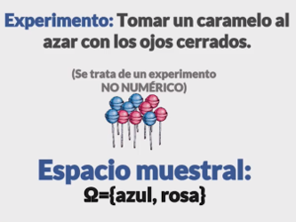

- **SUCESO ELEMENTAL:** es cada resultado que se obtiene de nuestro experiemento que se encuentra en el espacio muestral .

    los sucesos pueden ser:

  - **POSIBLE:** si el suceso elemental esta dentro mi espacio muestral es un suceso posible.

  - **SEGURO:** si el experimento pide caramelos azul y mi espacio muestral esta definido por caramelos azul es seguro.

  - **IMPOSIBLE:** que el experimento me pida un elemento que no este dentro de mi espacio muestral. que me pida un caramelo negro.

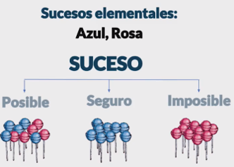

## Modulo 2. Probabilidad Simple

### Clase 3 Calculo de probabilidades

**Experimentos Equiprobables:** Cada suceso del espacio muestral tiene la misma probabilidad de ocurrencia (la misma posibilidad de aparecer como resultado), ejemplo lanzar un dado, lanzar una moneda con cara o cruz.

**Regla de Laplace:** Se usa en experimentos con resultados equiprobables, su formula casos favorables de A sobre el total de casos posibles.

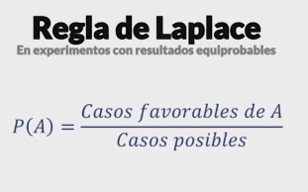

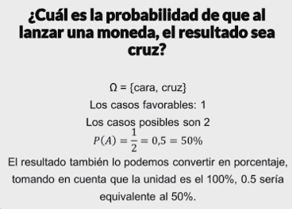

Ejercicio de Dado
Espacio Muestral = {1, 2, 3, 4, 5, 6}
A) Numero Par = 3/6 = 1/2
B) Múltiplo de 3 = 2/6
C) Mayor a 2 = 4/6 = 2/3 o 66.66%

Ejercicio probabilidad de sacar pelotas de Colores.
Espacio Muestral = {7 Blancas, 3 Negras, 5 Rojas}
A) Sacar Pelota Blanca = 7/15
B) Sacar Pelota Negra = 3/15 = 1/5
C) Sacar Pelota NO sea Roja = 10/15 = 2/3

Ejercicio de Personas en el Salón
Espacio Muestral = {6 Mujeres con Gafas, 6 Mujeres sin Gafas, 3 Hombres con Gafas, 10 Hombres sin Gafas}
A) Sea Mujer = 22/35
B) Sea Hombre sin Gafas = 10/35
C) Sea Hombre o Mujer = 35/35

## Modulo 3. Probabilidad Compuesta

### Clase 4 Probabilidad Compuesta y Diagramas de Árbol

**La probabilidad compuesta o condicionada** es aquella donde intervienen mas de un experimento aleatorio, (la probabilidad de ir a la playa, si mis papas me dan permiso) mide la probabilidad de un determinado suceso conociendo información previa sobre otro suceso; es decir, aquella donde intervienen más de un experimento aleatorio. Por ejemplo, tirar dos monedas al aire y mirar si salen dos caras o sacar dos canicas de una bolsa y que una sea blanca.

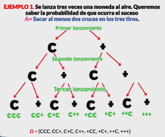

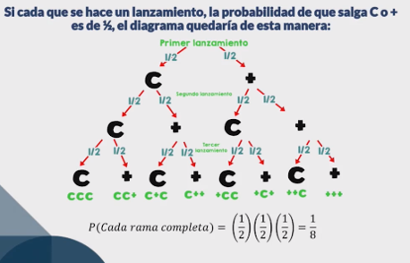

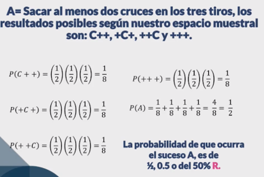

### Clase  Probabilidad Compuesta: Union

#### Tipos de sucesos

**Compatibles:** Son aquellos que suceden al mismo tiempo.

**Incompatibles:** Ambos sucesos no pueden ocurrir al mismo tiempo.

**Complementarios:** Son todos los elementales en un solo grupo que conforman el espacio muestral y que no se encuentran dentro de los sucesos anteriores.

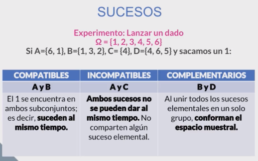

#### Union

Es un suceso formado por todos los resultados que cumplen A o Cumplen B.

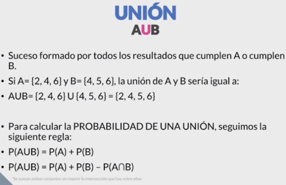

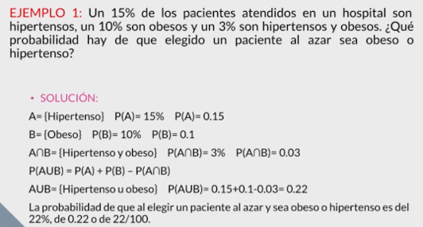

### Clase 6 Probabilidad Compuesta: Interseccion

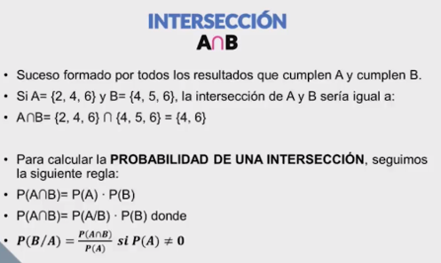

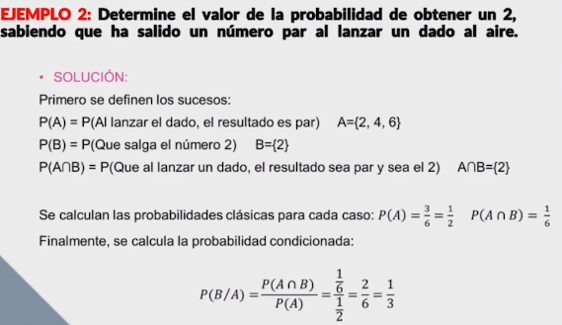

### Clase 7 Variaciones, permutaciones y combinaciones

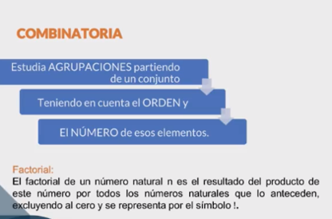

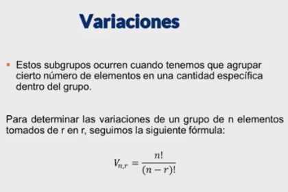

Para las siguientes formulas entender que:

n: Número de Elementos
r: Subgrupo de r en r (Agrupación de los elementos 2 en 2, 5 en 5, etc)
!: Factorial

Variación: Cuando creamos sub-grupos de elementos en una cantidad especifica dentro de un grupo [A, B, C, D] podemos tener sub-grupos de 2, teniendo las variaciones entre ellos sin importar el orden o repetición AB != BA

Vn,r = n! / (n-r)!

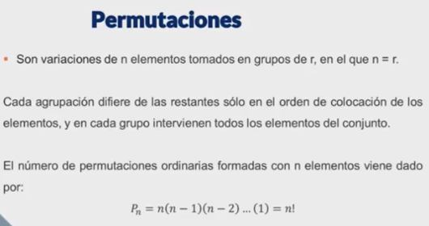


Permutación: Se toman todos los elementos dados. Importa el orden y se repiten los elementos, podemos intercambiar lugares.
Pn = n!

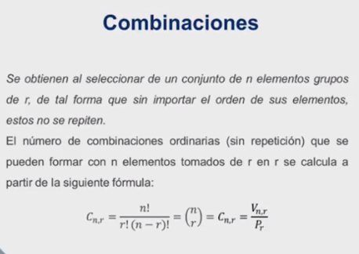

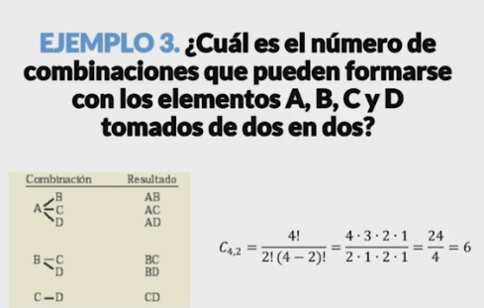


Combinación: Se toman parte de los elementos dados. No importa el orden y no se repiten los elementos.
Cn,r = n! / r! (n-r)!

Otra posible notación es nCr para representar Cn,rPara las siguientes formulas entender que:
n: Número de Elementos
r: Subgrupo de r en r (Agrupación de los elementos)
!: Factorial

Variación:
Vn,r = n! / (n-r)!

Permutación: Se toman todos los elementos dados. Importa el orden y no se repiten los elementos.
Pn = n!

Combinación: Se toman parte de los elementos dados. No importa el orden y no se repiten los elementos.
Cn,r = n! / r! (n-r)!

Otra posible notación es nCr para representar Cn,r

Ejemplo 1

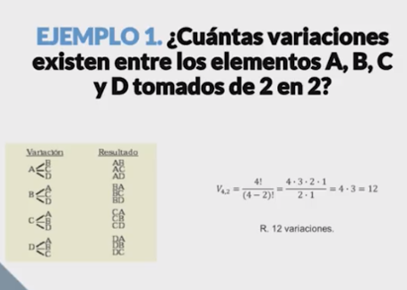

### Clase 8 Variaciones, permutaciones y combinaciones: Ejercicios

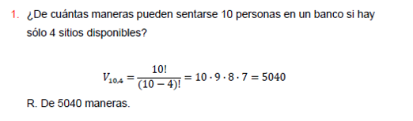


## Modulo 4. Distribución de Datos

### Clase 9 Tablas de Frecuencias

La **distribución de datos** es esencial para elegir el método estadístico correcto.

En estadística descriptiva los datos analizados pueden presentarse comúnmente mediante tres formas básicas:

- Gráficas
- En forma textual
- En cuadros estadísticos

La tabla de frecuencias (o distribución de frecuencias) es una tabla que muestra la distribución de los datos mediante sus frecuencias. Se utiliza para variables cuantitativas o cualitativas ordinales.

La tabla de frecuencias es una herramienta que permite ordenar los datos de manera que se presentan numéricamente las características de la distribución de un conjunto de datos o muestra

Ejemplo:

Una profesora tiene la lista de las calificaciones en matemáticas de 30
alumnos de su clase. Las notas son las siguientes:

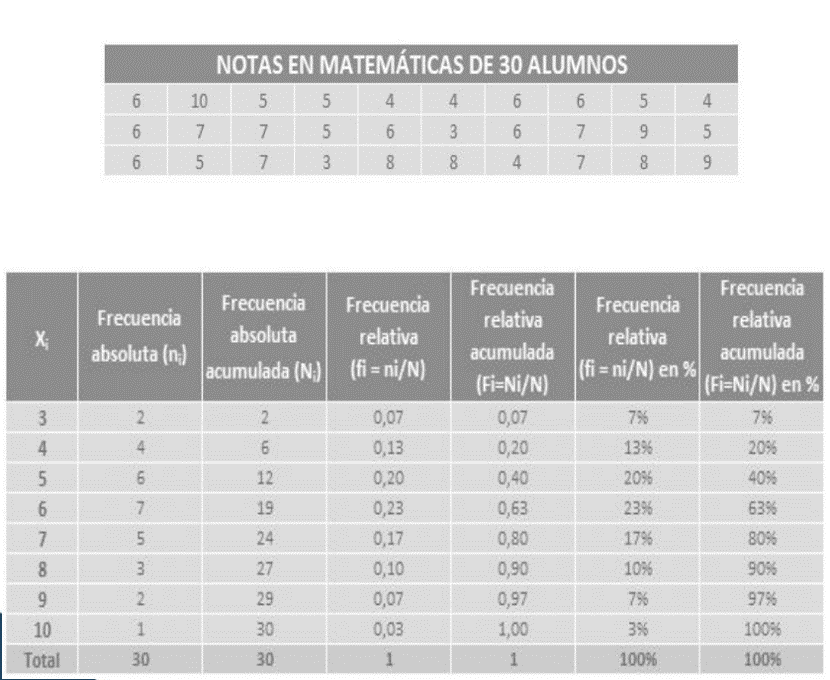

### Clase 10 Tablas de Frecuencia en Distribución de Datos: Ejercicios

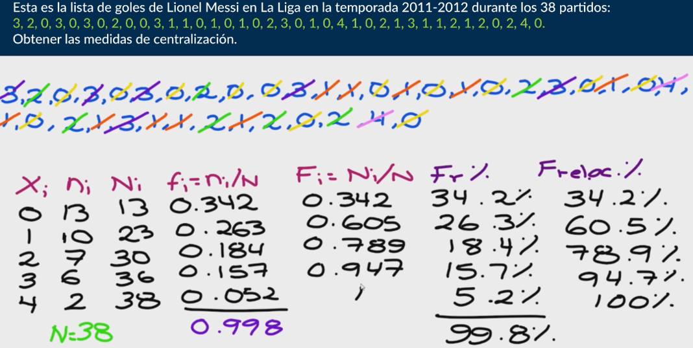

### Clase 11 Tablas de Frecuencia Graficas

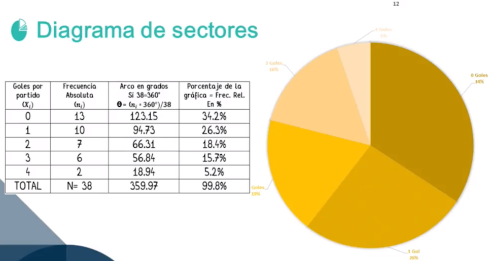

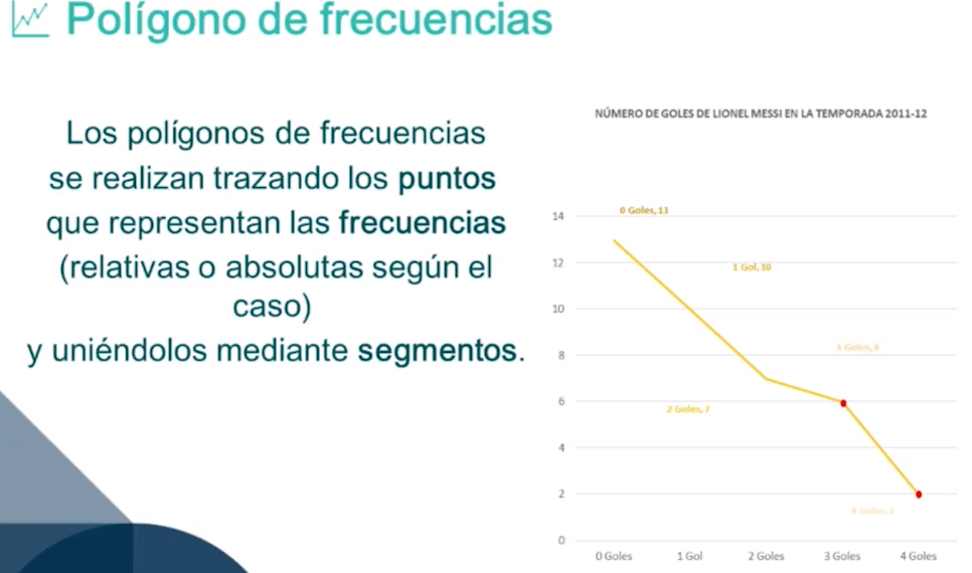

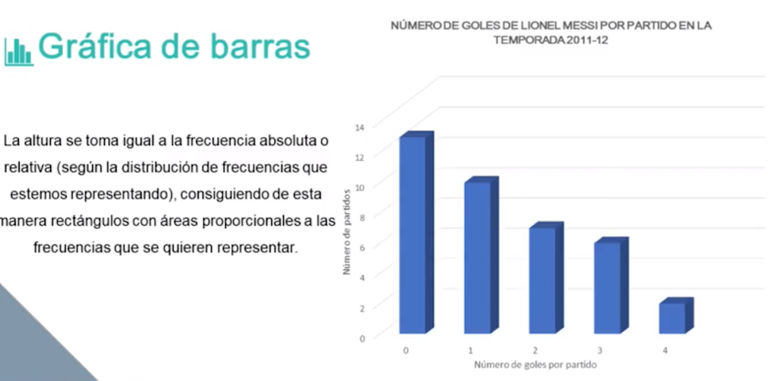

## Modulo 5. Medidas de Tendencia Central

### Clase 12 Grafica de Despersion

#### Gráficas de Dispersion

Relacionan los datos de estudio. Estas gráficas las representamos en un diagrama matemático mediante coordenadas cartesianas que generan puntos dispersos alrededor del plano

#### Diagramas de dispersion 

**Nube de puntos:** Analiza la relación entre dos variables estadísticas bidimensionales, conociendo que tanto se afectan entre si o que tan independientes son una de otra.

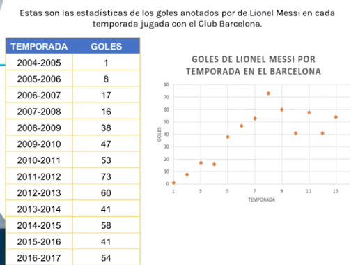

```py
import matplotlib.pyplot as plt

temporadas =(1, 2, 3, 4, 5, 6, 7, 8, 9, 10, 11, 12, 13)

goles = (1, 8, 17, 16, 38, 47, 53, 73, 60, 41, 58, 41, 54)


plt.scatter(temporadas, goles)
plt.xlabel('Temporadas en el Barcelona F.C.')
plt.ylabel('Cantidad de goles')
plt.title('Goles de Messi en el Barcelona F.C.')

plt.text(8, 73,  'Record en la Liga')
```

### Clase 12 Parámetros Estadísticos, Centralización

Parámetros Estadísticos de centralización: los dignos representantes de una muestra grande, son valores centrales de conjunto de valores recogidos y representan, de forma global a toda la población o muestra.

- **Media:** Es el valor característico de la serie de datos resultado de la suma de todas las observaciones dividido por el numero total de datos. (comúnmente llamado  promedio)


- **Mediana:** Es el valor de la variable de posición central en un conjunto de datos ordenados. Dependiendo de si el numero de datos es impar o par, se utilizan las siguientes formulas en ese orden la primera para arrays par y la segunda para impares:

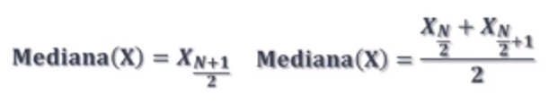

- **Moda:** Es el valor mas repetido del conjunto de datos. Puede haber mas de una moda.

### Clase 14 Parámetros Estadísticos, Centralización: Ejercicio

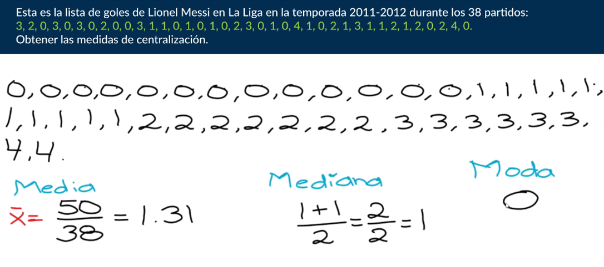

```py
import numpy as np
from scipy import stats

dataset= [0,0,0,0,0,0,0,0,0,0,0,0,0,0,1,1,1,1,1,1,1,1,1,1,1,1,1,2,3,4,5,6,6,7]

#mean value
mean= np.mean(dataset)

#median value
median = np.median(dataset)

#mode value
mode= stats.mode(dataset)

print("Mean: ", mean)
print("Median: ", median)
print("Mode: ", mode)
```

### Clase 15 Tipos de Correlación Y Covarianza

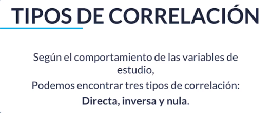

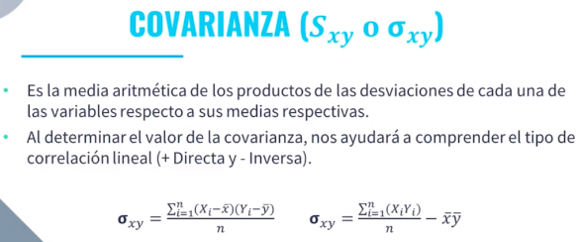

**Covarianza:** Sirve para saber qué tipo de correlación habrá entre las 2 variables, es decir, cómo impactará una variable a la otra.

Es la media aritmética de los productos de las desviaciones de cada una de las variables respecto a sus medias respectivas.

Al determinar el valor de la covarianza nos ayudara a comprender el tipo de correlacion lineal (Directa si el resultado es positivo, o inversa si el resultado es negativo)

Tipos de correlación:

**Correlación Directa:** Si una variable aumenta, la otra también. Si la variable disminuye, la otra también. Lo hace de manera proporcional.

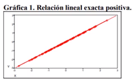

**Correlación Inversa:** Si una variable aumenta, la otra disminuye. Si la variable disminuye, la otra aumenta. Lo hace de manera proporcional.

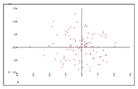

**Correlación Nula:** No hay un comportamiento claro en cómo afecta una variable a la otra.

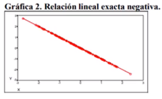

### Niveles de correlación

**Correlación Nula:** No existe una linea clara entre los puntos del gráfico.

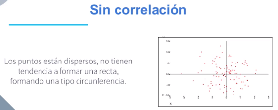

**Correlación Fuerte:** Los puntos están muy cerca a la línea del gráfico.

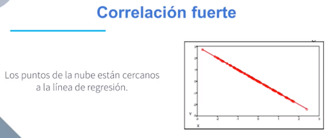

**Correlación Débil:** los puntos siguen la línea del gráfico, pero de lejos.

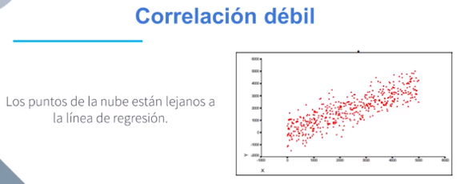

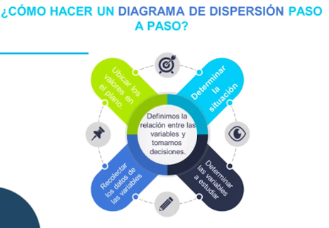

## Modulo 6. Medidas de Dispersión

### Clase 16 Rango

#### Parametros Estadisticos de Dispersion

Son una serie de valores que indican **lo disperso o agrupados* que están los datos entre si y respecto a la media

#### Rango o Amplitud

- Es el **recorrido** de la distribución estadistica
- Dada una serie de valores x1, x2,... xn, su recorrido es la diferencia aritmética entre el máximo y el mínimo de estos valores:

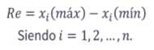

#### Rango Datos No Agrupados

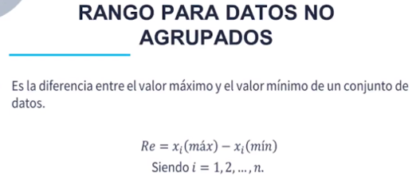

**Ejemplo**.


#### Rango Datos Agrupados

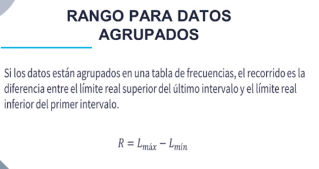

**Ejemplo**.

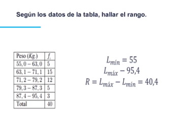

El rango mide **"La dispersion total** del conjunto de datos mostrado.

Aunque el rango es una medida de dispersion simple y que se calcula con facilidad, su debilidad preponderante es que no toma en consideración la forma en que se distribuyen los datos entre los valores mas pequeños y los mas grandes. Es una medida general.

### Clase 17 Desviacion Media

#### Desviacion Media para Datos No Agrupados

Es la **media aritmética** de los valores absolutos de las desviaciones de todos los datos respecto a la media aritmética.

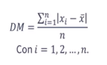

**Ejemplo**.

Recuerda que las operaciones entre pipes |4  - 9 | indica que tomamos su valor absoluto

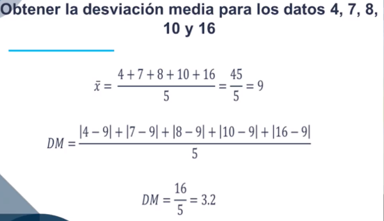

#### Desviacion Media para Datos Agrupados

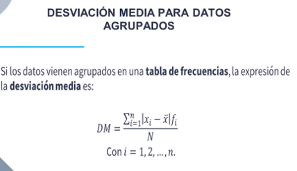

**Ejemplo**.

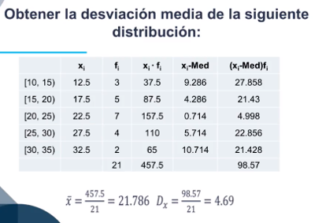

### Clase 18 Varianza y Desviacion Estandar

**Varianza:** que tan separados están nuestros datos entre si

**Desviacion Estandar:** raíz cuadrada de la  varianza

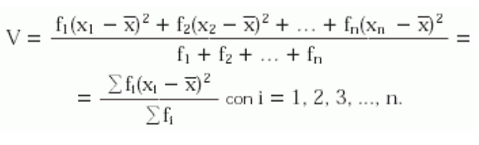

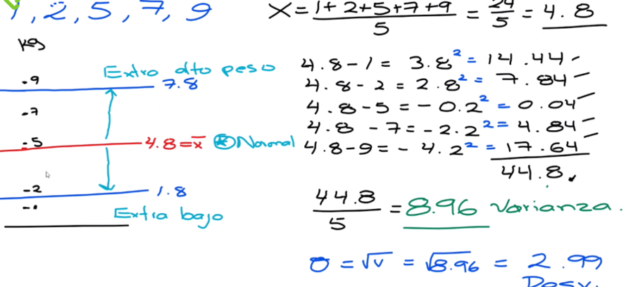

### Clase 19  Coeficiente de Correlacion en un Diagrama de Dispersion

**Coeficiente de correlacion** describe como es la relacion existente **entre dos variables**.

El Coeficiente de Correlacion es un valor cuantitativo de relacion entre dos o mas variables.

La correlacion de proporcionalidad directa o positiva se establece con los valores +1.00 y de proporcionalidad inversa o negativa con -1.00.

No existe relacion entre las variables cuando el coeficiente es de 0.00.

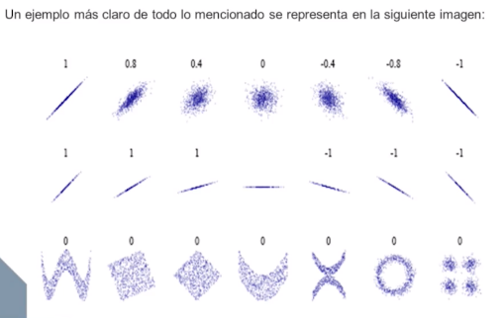

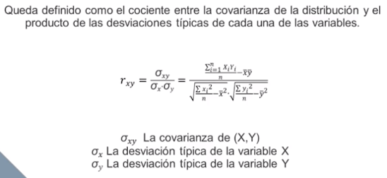

**Ejemplo**.

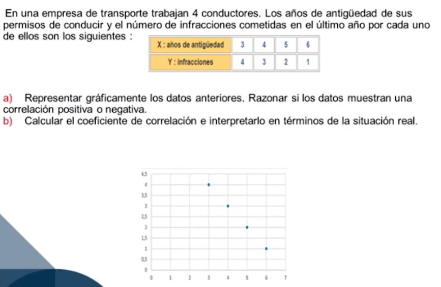

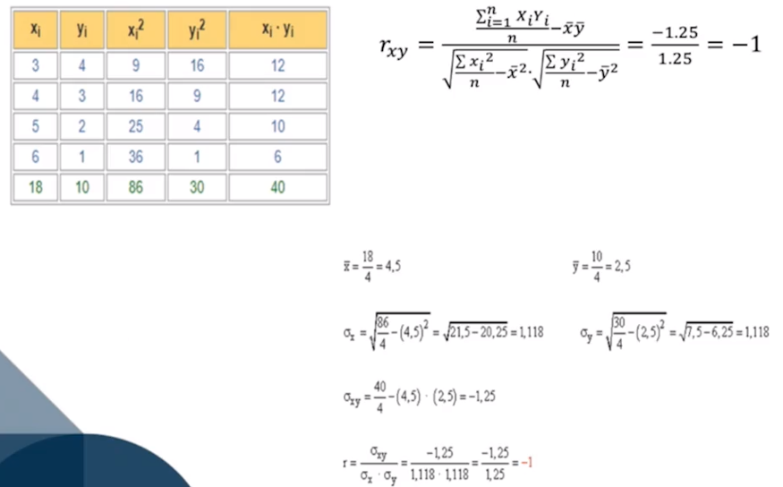

## Modulo 7. Medidas de Posición

### Clase 18 Cuartiles, Deciles y Percentiles

#### Parametros Estadisticos de Posicion

Tienen como funcion **ubicar la distribución a lo  largo de los valores de la misma.**

Se suelen utilizar una serie de valores que dividen la muestra en tramos iguales.

**Cuartiles:** son los **tres valores** de la variable que **dividen** a un **conjunto de datos ordenados** en **cuatro partes iguales**.

Los cuartiles determinan los valores correspondientes de los datos Q1=25%, Q2= 50% y Q3=75%.

Observa que Q2 coincide con la **mediana**.

**Deciles:** son **9 valores** y dividen nuestro conjunto en **10 partes**: D1=10%, D2=20%…D9 = 90%.

D5 coincide con la **mediana**.

**Percentiles:** son **99 valores**, dividen nuestro conjunto en **100 partes iguales**,  estos dan los valores P1=1%, P2=2%…,…P99=99%. 

P50 coincide con la **mediana**, P50 coincide con D5.

### Clase 21 Cuartiles

Los **cuartiles** son los **tres valores** de la variable que **dividen** a un conjunto de **datos ordenados** en **cuatro partes iguales**.


### Clase 22 Deciles

Los deciles son los **nueve valores** que dividen la serie de datos en **diez partes iguales**


### Clase 23 Percentiles

Los deciles son los **noventa y nueve valores** que dividen la serie de datos en **cien partes iguales**


## Modulo 8. Regresión Lineal

### Clase 24 Que es y para que sirve la Regresion Lineal

Regresión Lineal = regresión simple, predecir un valor futuro basados en una secuencia de datos.

La regresión lineal NO DEBERÍA (aunque sé que se usa exitosamente en muchas ocasiones) usarse para predecir valores futuros. Únicamente describe y aproxima a una función el comportamiento de una serie de muestras obtenidas, pero es un error pensar que este comportamiento siempre es el mismo para la función que describe el fenómeno estudiado.

### Clase 25 Ejemplo de Regresión Lineal (Tipo de Correlacion)


### Clase 26 Ejemplo de Regresion Lineal (predecir el futuro)


